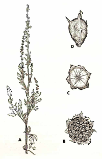

# AltamISA

An implementation of [ISA-tools](http://isa-tools.org/) [data model](http://isa-specs.readthedocs.io/en/latest/isamodel.html) and [ISA-Tab file format](http://isa-specs.readthedocs.io/en/latest/isatab.html).
